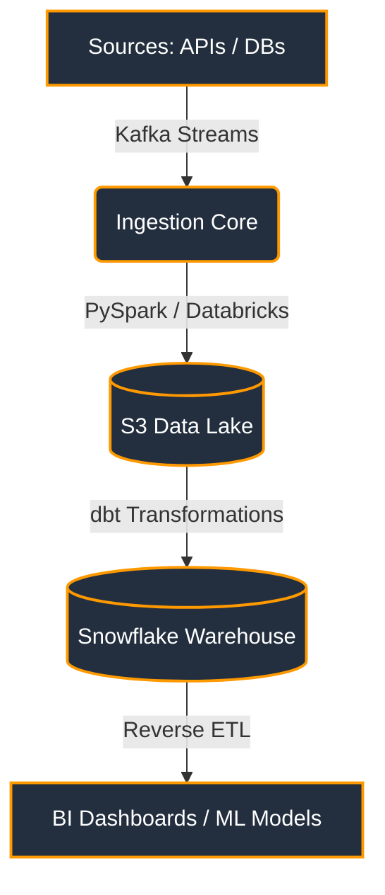

# Hi there, I'm a Data Engineer! 👋 

  
  

---

## ⚡ Automated Core Architecture Stack

I build, orchestrate, and optimize distributed data pipelines.

---

## 🛠️ Ecosystem & Tooling

<table>
  <tr>
    <td align="center" width="25%">
       
      <b>Processing</b>
    </td>
    <td align="center" width="25%">
       
      <b>Streaming</b>
    </td>
    <td align="center" width="25%">
       
      <b>Orchestration</b>
    </td>
    <td align="center" width="25%">
       
      <b>Storage</b>
    </td>
  </tr>
</table>

---

## 📊 Live GitHub Engine Metrics

These widgets automatically animate and update based on your actual GitHub coding activity.

  
  

---

## 🎯 Current Operational Focus

- 🔄 **Optimizing**: Reducing Snowflake compute costs by refactoring `dbt` incremental models.
- 🧪 **Experimenting**: Building event-driven pipelines using **Apache Flink**.
- 📝 **Writing**: Sharing engineering runbooks and optimization strategies on my personal blog.

---

## 📨 Connect With Me

  

